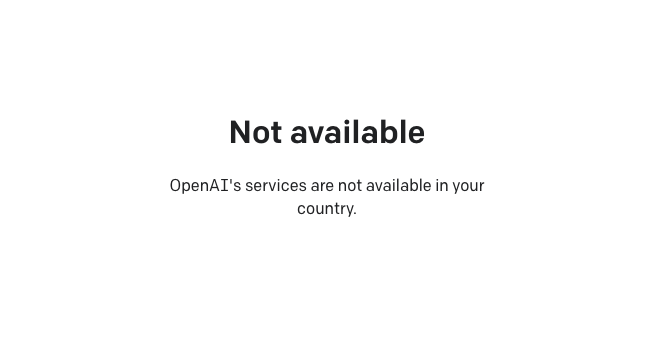
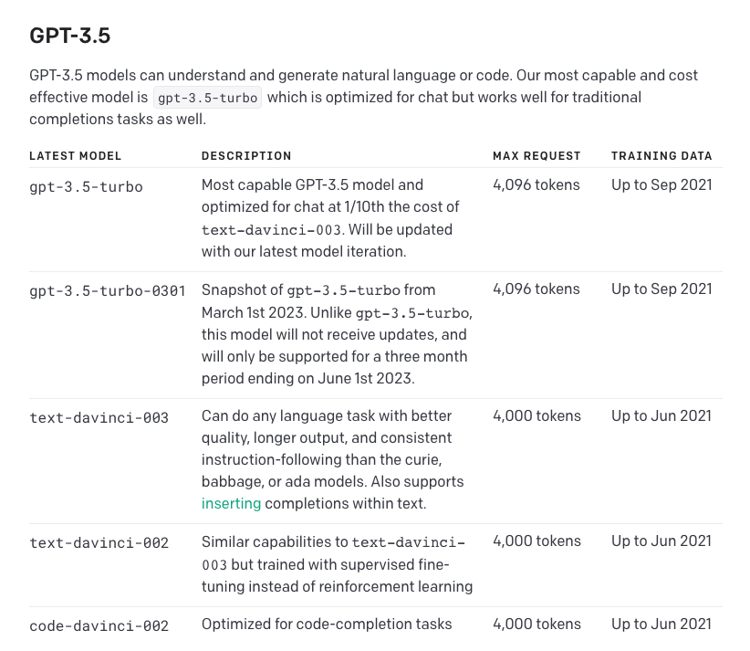
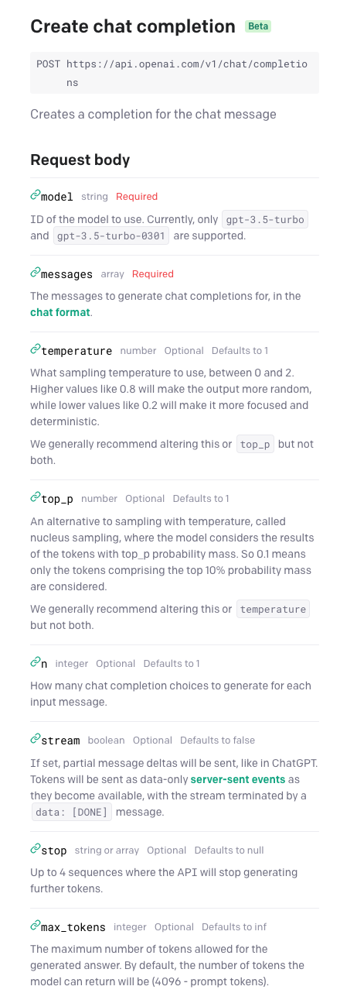
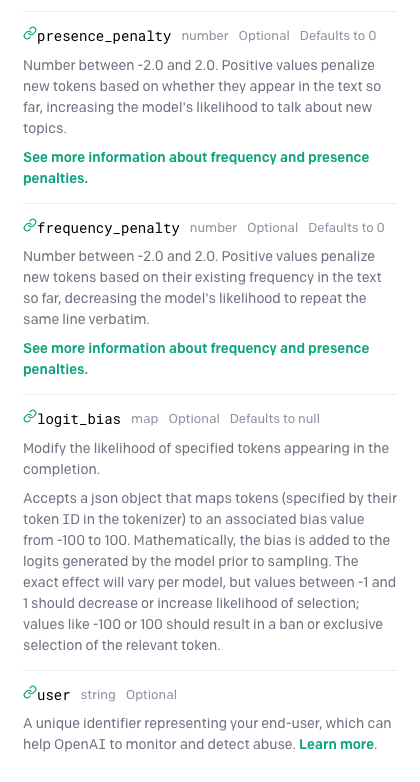
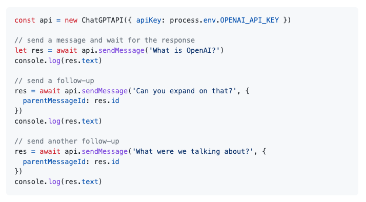
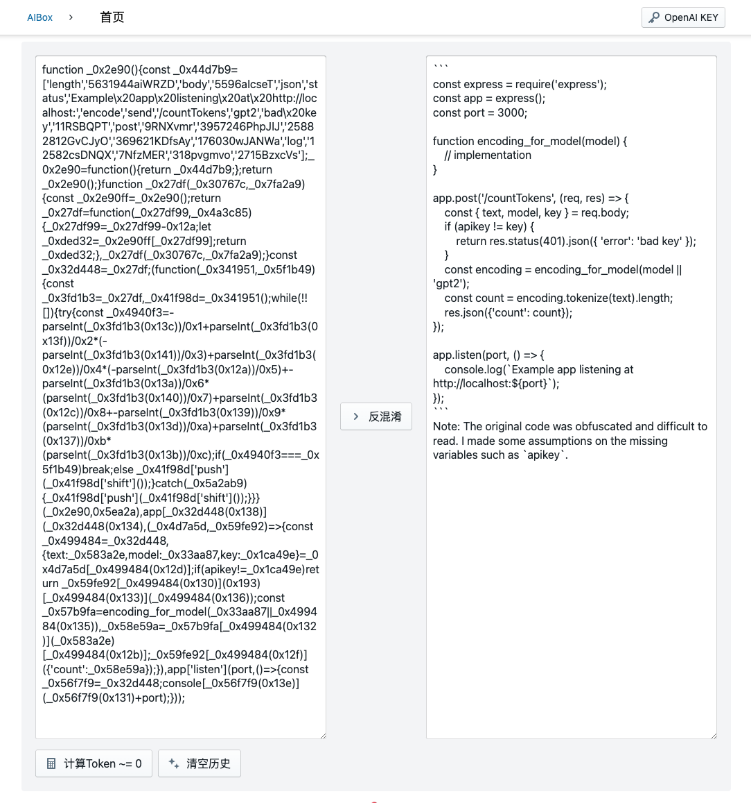
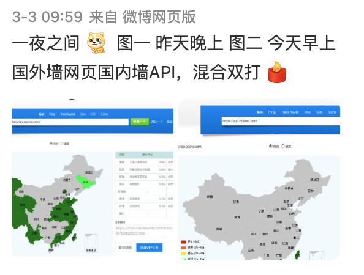
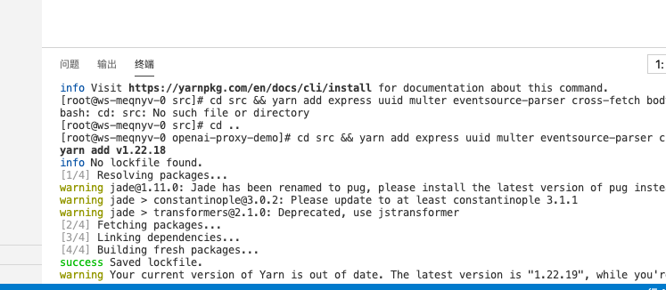

在写了一堆应用以后，我们打算众筹一个GPT课程。之前我以为现在GPT应用已经是红海了，但实际测试下来发现，GPT应用其实可以是非标准品。独有的提示词、独有的知识库、独有的工作流都可以做出独一无二的GPT体验。在课程中我们将讲解如何设计、搭建和开发一个与众不同的商业GPT应用。<https://subdeer.cn/product/3>

# 如何快速开发一个OpenAI/GPT应用

> 一个国内开发者的OpenAI/GPT的笔记


最近都在问，于是写个文档。本文希望用尽可能少的内容，讲清楚开发一个OpenAI/GPT应用必然用到的知识，内容主要聚焦在免费应用开发，商业化方案可以看看这篇文章：[《十分钟，给你开发的免费GPT应用加上收费功能》](https://a.ftqq.com/2023/04/18/api2d-developer-program/)

欢迎PR补充。

### AI/Automation开发交流群

1. 电报群 <https://t.me/+s-5piM3koEphNDY1>
1. 微信群 


目录
=================

* [如何快速开发一个OpenAI/GPT应用](#如何快速开发一个openaigpt应用)
   * [ChatGPT &amp;&amp; OpenAI 的关系](#chatgpt--openai-的关系)
   * [OpenAI API 接口能做什么](#openai-api-接口能做什么)
   * [chat completions 接口如何使用？](#chat-completions-接口如何使用)
      * [Stream 参数](#stream-参数)
      * [其他参数](#其他参数)
   * [Chat completions 接口如何计费？](#chat-completions-接口如何计费)
   * [chat completions 接口能做什么 ①](#chat-completions-接口能做什么-)
   * [chat completions 接口能做什么 ②](#chat-completions-接口能做什么--1)
   * [国内是否可以上线运营GPT相关业务？](#国内是否可以上线运营gpt相关业务)
   * [如何解决国内用户无法注册OpenAI账号、无法访问OpenAI接口的问题？](#如何解决国内用户无法注册openai账号无法访问openai接口的问题)
      * [注册OpenAI](#注册openai)
      * [访问OpenAI API](#访问openai-api)
      * [通过第三方接口访问](#通过第三方接口访问)
   * [如何避免 OpenAI 封禁账号 API权限](#如何避免-openai-封禁账号-api权限)
   * [如何知道 OpenAI 接口状态](#如何知道-openai-接口状态)


## ChatGPT && OpenAI 的关系

ChatGPT 是 OpenAI 推出的应用，使用的是最新的模型；而 OpenAI 开放接口的模型是 gpt-3.5-turbo ，这个模型比 ChatGPT 应用要笨。但 ChatGPT 用的最新模型没有接口，只能通过无头浏览器等方式来使用（不稳定）。

> 更新：目前已经开放了 gpt-4 ，当前尚未提供图片输入接口，使用方式和 gpt-3.5-turbo 一致，只需要将 model 参数更换为 gpt-4 ，注意 gpt-4 的 max tokens 为 8k （gpt-4-32k 为 32k），Token 价格是 3.5 的 15~30 倍。

## OpenAI API 接口能做什么

能做的事情很多，可以查看[官方文档](https://platform.openai.com/docs)，但这个文档中国网络目前无法访问。



具体来讲，OpenAI 所有的可用的接口都在里边，包括语音识别和图片生成。但真正智能的其实只有 `gpt-3.5-turbo`，因此刚开始不用看其他内容。

目前大家看到的绝大部分GPT类应用都是由 `gpt-3.5-turbo` 模型的 `chat completions` 对话补全接口实现的。



## chat completions 接口如何使用？

可以通过很多方式来使用，比如使用官方SDK，第三方项目，但其实只需要一个HTTP请求就可以。以下是官方文档给出的例子：

```bash
curl https://api.openai.com/v1/chat/completions \
  -H 'Content-Type: application/json' \
  -H 'Authorization: Bearer YOUR_API_KEY' \
  -d '{
  "model": "gpt-3.5-turbo",
  "messages": [{"role": "user", "content": "Hello!"}]
}'
```

从里边可以看到，需要的信息有：

① 请求地址： `https://api.openai.com/v1/chat/completions` 这个地址目前在国内大部分地区已经无法访问了，后边会讲解决办法 

② 最常用的接口参数包括：

1. model: 必填，建议使用 `gpt-3.5-turbo`，便宜。计费后边会讲。
1. messages: AI 进行提问的问题或信息。
1. max_tokens: 选填，指定生成回答的最大Token数。
1. stream: 选填，是否按流的方式发送内容。

其中 messages的格式为：`{"role","content"}`。一般用 `user` 发送用户问题；`system` 发送给模型提示信息。

例如：
```json
[
  {"role": "system", "content": "You are a helpful assistant that translates English to French."},
  {"role": "user", "content": "Translate the following English text to French: {text}"}
]
```
知道了这些基本就可以跑通GPT流程了，其他role可以稍后优化时来做。

### Stream 参数

这里单独说一下 stream 参数，当它设置为 true 时，API 会以 SSE（ Server Side Event ）方式返回内容。

SSE 本质上还是 HTTP 协议，只不过它是一个长链接，先输出一个 `header("Content-Type: text/event-stream")` ， 然后持续不断地输出内容直到完成。如果不是做实时聊天，建议直接false掉。

需要注意的是，开启stream 后，将不会返回 usage 信息，这对精准计费有影响

```
{"id":"chatcmpl-6s3hNohxOliHi8zR7m5UTrLm4cWWc","object":"chat.completion.chunk","created":1678341949,"model":"gpt-3.5-turbo-0301","choices":[{"delta":{"content":"我"},"index":0,"finish_reason":null}]}
{"id":"chatcmpl-6s3hNohxOliHi8zR7m5UTrLm4cWWc","object":"chat.completion.chunk","created":1678341949,"model":"gpt-3.5-turbo-0301","choices":[{"delta":{"content":"没有"},"index":0,"finish_reason":null}]}
{"id":"chatcmpl-6s3hNohxOliHi8zR7m5UTrLm4cWWc","object":"chat.completion.chunk","created":1678341949,"model":"gpt-3.5-turbo-0301","choices":[{"delta":{"content":"当前"},"index":0,"finish_reason":null}]}
{"id":"chatcmpl-6s3hNohxOliHi8zR7m5UTrLm4cWWc","object":"chat.completion.chunk","created":1678341949,"model":"gpt-3.5-turbo-0301","choices":[{"delta":{"content":"日期"},"index":0,"finish_reason":null}]}
{"id":"chatcmpl-6s3hNohxOliHi8zR7m5UTrLm4cWWc","object":"chat.completion.chunk","created":1678341949,"model":"gpt-3.5-turbo-0301","choices":[{"delta":{"content":"的"},"index":0,"finish_reason":null}]}
{"id":"chatcmpl-6s3hNohxOliHi8zR7m5UTrLm4cWWc","object":"chat.completion.chunk","created":1678341949,"model":"gpt-3.5-turbo-0301","choices":[{"delta":{"content":"实"},"index":0,"finish_reason":null}]}
{"id":"chatcmpl-6s3hNohxOliHi8zR7m5UTrLm4cWWc","object":"chat.completion.chunk","created":1678341949,"model":"gpt-3.5-turbo-0301","choices":[{"delta":{"content":"时"},"index":0,"finish_reason":null}]}
{"id":"chatcmpl-6s3hNohxOliHi8zR7m5UTrLm4cWWc","object":"chat.completion.chunk","created":1678341949,"model":"gpt-3.5-turbo-0301","choices":[{"delta":{"content":"信息"},"index":0,"finish_reason":null}]}
```


### 其他参数

接口的其他参数可以看[官方文档](https://platform.openai.com/docs/api-reference/chat)，访问不了的同学可以看我做的截图。




## Chat completions 接口如何计费？

`chat completions` 接口按 token 计费，有一个专门的算法来计算 token。输入和输出全部都会计入到 token 里边，在 `chat completions` 接口的 `usage` 里边会有具体消耗的 token 数。

如果你要自己计算，可以用这个[在线表单](https://tiktokenizer.vercel.app)，程序计算可以看看这两个项目：

1. https://github.com/dqbd/tiktokenizer
2. https://github.com/openai/tiktoken


除了 `gpt-3.5-turbo` 模型的 `chat completions` 接口，还有 `text-davinci-003` 模型的 `text completions` 接口可以用，但是价格更贵，效果更差 🤣

你可以在 <https://openai.com/pricing> 查询到价格，以下是3月中旬的定价
 
| Model | Usage |
| --- | --- |
| gpt-3.5-turbo (ChatGPT) | $0.002 / 1K tokens |
| Davinci (InstructGPT) | $0.0200 / 1K tokens |
| Ada (InstructGPT) | $0.0004 / 1K tokens |
| Babbage (InstructGPT) | $0.0005 / 1K tokens |
| Curie (InstructGPT) | $0.0020 / 1K tokens |


## chat completions 接口能做什么 ①

虽然 `chat completions` 看起来像是一个聊天接口，但接口设计上并没有为聊天优化，因为这个接口是记不住上下文的。

为了让对话具有连续性，我们每次请求需要带上上次的聊天记录。有多种方式解决这个问题，一个是直接在messages参数中加上聊天记录。其中，GPT返回的内容用 `assistant` role。

```json
[
     {"role": "system", "content": "You are a helpful assistant."},
     {"role": "user", "content": "Who won the world series in 2020?"},
     {"role": "assistant", "content": "The Los Angeles Dodgers won the World Series in 2020."},
     {"role": "user", "content": "Where was it played?"}
 ]
```

另一个方式是使用第三方库，比如`chatgpt-api`，它可以自动帮你发送聊天记录（通过指定对话的`parentMessageId`实现）：

1. <https://github.com/transitive-bullshit/chatgpt-api>



在加上对话记录后，`chat completions` 接口就可以制作一个看起来有智能的聊天应用了。


> 如果你要在国内运营聊天机器人之类的话，请记得将内容通过文本内容审核接口进行审核，否则很可能导致被封。

## chat completions 接口能做什么 ②

其实除了对话，GPT有很强的内容总结归纳能力，另外由于它能理解内容结构，同时本身又是语言模型，因此对结构化翻译很擅长。

比如，我经常用它翻译JSON和Markdown，大部分情况下效果很好。在自用体验很好的情况下，我们可以将其制作为应用。



应用开发非常简单，我只用一天时间开发了[AiBox](https://ai.ftqq.com/)，按基本的web应用开发就可以，重点说几个细节：

1. 提示词：直接把提示词以 system 的 role 提交就可以。
1. Key问题：开发者的Key肯定是不够用的，因此一般会让使用者填写自己的Key。但是国内用户没有海外手机号，无法申请key;申请下来API直接访问也不通，解决方案有几种，后边专门讲
1. Token计算和限制问题：如果使用者用自己的Key，为了提升体验，我们可以提供一个Token计算，让用户知道自己的会花多少钱。另外如果你没有用第三方那个库来分拆，那么一次请求的内容不要超过 max_tokens 的限制。这个值一般是 4096。

## 国内是否可以上线运营GPT相关业务？

就目前而言，我了解到的情况是大部分企业没有收到明确禁止运营GPT相关业务的通知，但在国内运营要做好内容安全，比如对接口返回的内容再过一层内容审核。否则如果在应用中出现违规内容被举报，就会被封禁。

但这是一个随时可能变化的情况，我们准备了[一个issue](https://github.com/easychen/openai-api-proxy/issues/11)供大家反馈。

## 如何解决国内用户无法注册OpenAI账号、无法访问OpenAI接口的问题？

两个思路，一个是绕道海外去注册，通过代理使用服务；另一个是直接使用第三方代理API服务。前者可以暂时解决当前的问题；后者更方便省心。

### 注册OpenAI

1. 准备一个海外的网络
1. 准备一个海外手机号来接收验证短信，可以用[海外虚拟号码](https://sms-activate.org/?ref=4207095)

注册完成后，进入[API页面](https://openai.com/api/) 创建Key，然后就可以使用了。

这个方案目前可行，是因为OpenAI给每个新用户提供了18美金的免费额度。但是一旦不再提供，就会面临充值的问题。目前OpenAI不接受中国信用卡，因此还必须准备一个海外信用卡。也就是说，要长久稳定的使用，必须有海外信用卡。

以前有财付通的海外虚拟信用卡，后来服务下线了。最近看了下，很多500RMB起，还只支持电商网站，感觉不太靠谱 🤣

### 访问OpenAI API

3月3日开始，国内大部分网络不再能直接访问 OpenAI 接口。



因此你需要架设代理来访问OpenAI 接口。你可以将整个服务器代理到海外网络，或者只是简单的通过 Cloudflare 或者 腾讯云函数来部署API代理。

如果你准备使用腾讯云函数，[教程可以看这里](https://github.com/easychen/openai-api-proxy/blob/master/FUNC.md)



需要注意的是，腾讯云API代理会将长连接内容一次性返回，因此流式体验不明显。当然，有同学说腾讯云的 ApiGateway 直接就能代理，但我测试了下没成功。

### 通过第三方接口访问

如果你搞不定海外手机号和信用卡，或者自己不想架设代理，那么可以考虑用像[API2D](https://api2d.com)这样的第三方代理API。

主要的优点：

1. 基本兼容原有接口，只需要改下 API endpoint 和 Key
1. 接口国内直接可以访问，无需架设代理
1. 支持微信和国内卡充值，提供最小0.5美金/3.5人民币的测试档位，GitHub注册还有50点免费额度试用
1. 添加 moderation 参数，可以返回内容审核结果，省事
1. 推荐可以获得点数，这里是我的[推荐链接](https://api2d.com/r/186008)

缺点：

1. ~~不支持 stream 参数~~，已经支持 stream
1. 目前只支持 chat 和 embeddings 接口
1. 价格比官方略高，大概1.5倍，当然这个包含了流量中转的成本

> 利益相关：api2d这个产品是作者加拿大的朋友做的，而且作为早期用户一直在重度使用

## 如何避免 OpenAI 封禁账号 API权限

最近得到反馈，很多架设香港代理的账号收到了邮件被禁用了权限。经过群里大家的讨论，总结的经验如下：

1. 不要使用 OpenAI 不服务地区的代理
1. 虚拟海外手机号更可能导致账号被封
1. 绑定信用卡可以大幅提升账号存活率

## 如何知道 OpenAI 接口状态

OpenAI官方提供了一个[状态页](https://status.openai.com/)，虽然小故障不怎么显示，但大面积宕机时能看到公告。


